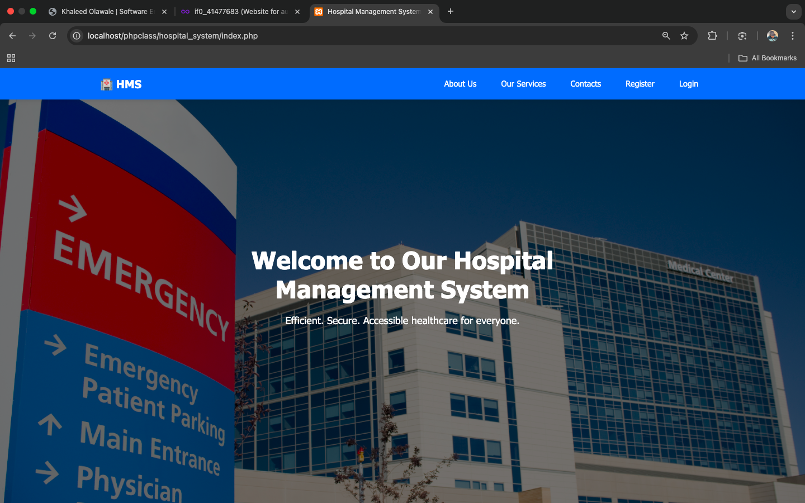
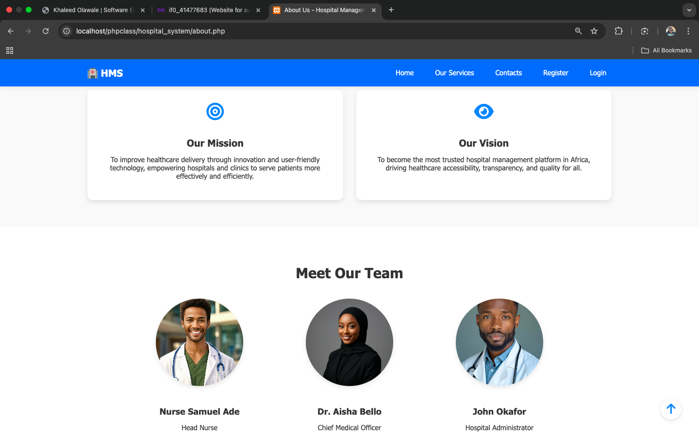
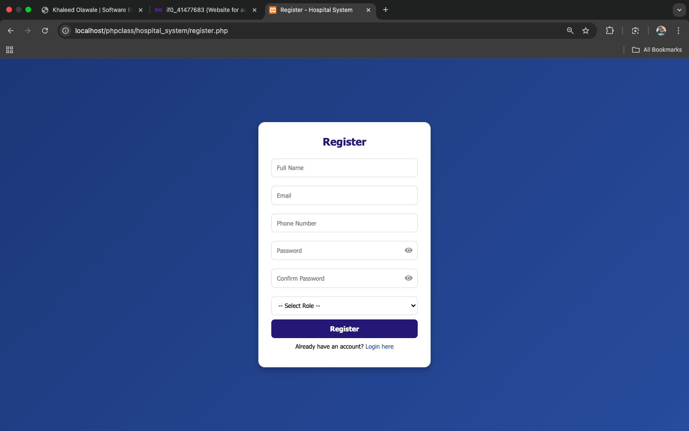
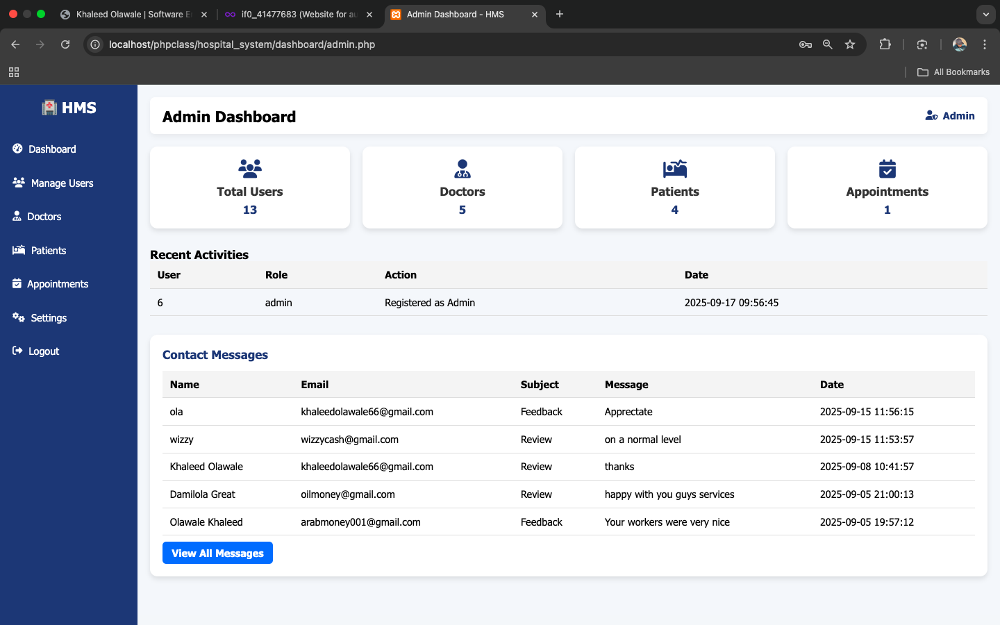
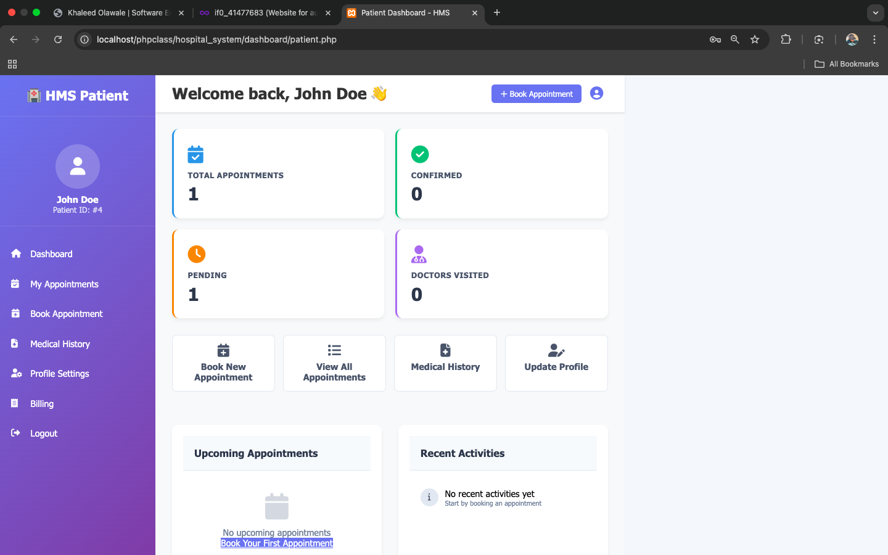

# 🏥 Hospital Management System

A fully functional and responsive Hospital Management System built using modern web technologies, designed to streamline hospital operations including patient management, appointments, and administrative tasks.

---

## 📖 Overview

This system provides an efficient way to manage hospital activities through a user-friendly interface. It supports both frontend and backend functionalities, ensuring smooth data handling, secure access, and responsive design across devices.

---

## 💻 GitHub Repository
https://github.com/khaleedolawale/hospital-management

---

## 📸 Screenshot

---

## 📌 Features

- 👨‍⚕️ Patient registration and management  
- 📅 Appointment scheduling system  
- 🔐 Secure authentication system (Admin/User login)  
- 🗂️ Dashboard for managing hospital data  
- 📊 Real-time data handling and updates  
- 📱 Fully responsive design (mobile-friendly)  
- 🧾 Record management for patients and services  

---

## 🛠️ Tech Stack / Tools Used

### Frontend
- HTML  
- CSS  
- JavaScript  

### Backend
- PHP 
- MySQL

### Tools
- phpMyAdmin  
- XAMPP *(for local development)*  
- Git & GitHub  

---

## 🎯 Purpose

This project was developed to simulate a real-world hospital management system, demonstrating full-stack development skills including database integration, user authentication, and responsive UI design.

---

## 📬 Contact

For collaboration, opportunities, or feedback, feel free to reach out.

---

## ⭐ Acknowledgements

This project was built as part of practical learning and hands-on experience in full-stack web development.
